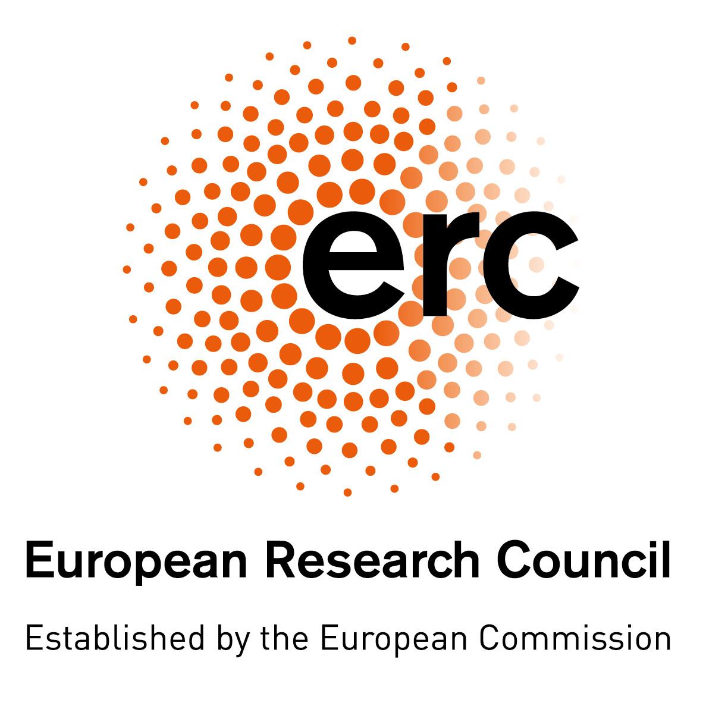
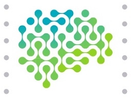

+++
# People widget.
widget = "people"  # See https://sourcethemes.com/academic/docs/page-builder/
headless = true  # This file represents a page section.
active = true  # Activate this widget? true/false
weight = 68  # Order that this section will appear.

title = "The SPHINX group"
subtitle = "Meet the team working in the Sphinx Group. Our interdisplinary research group embodies physicists, mathematicians, and computer scientists working together to solve problems ranging from statistics to signal processing and machine learning. We also enjoy a long-standing collaboration with the SMILE team of [Lenka Zdeborova](http://artax.karlin.mff.cuni.cz/~zdebl9am/). Feel free to check the group [github repo](https://github.com/sphinxteam)."

# List user groups to display.
#   Edit each user's `user_groups` to add them to one or more of these groups.
user_groups = ["Grad Students",
               "Postdocs",
	       "Master Students"]
+++

The SPHINX team acknodlegde funding from:

